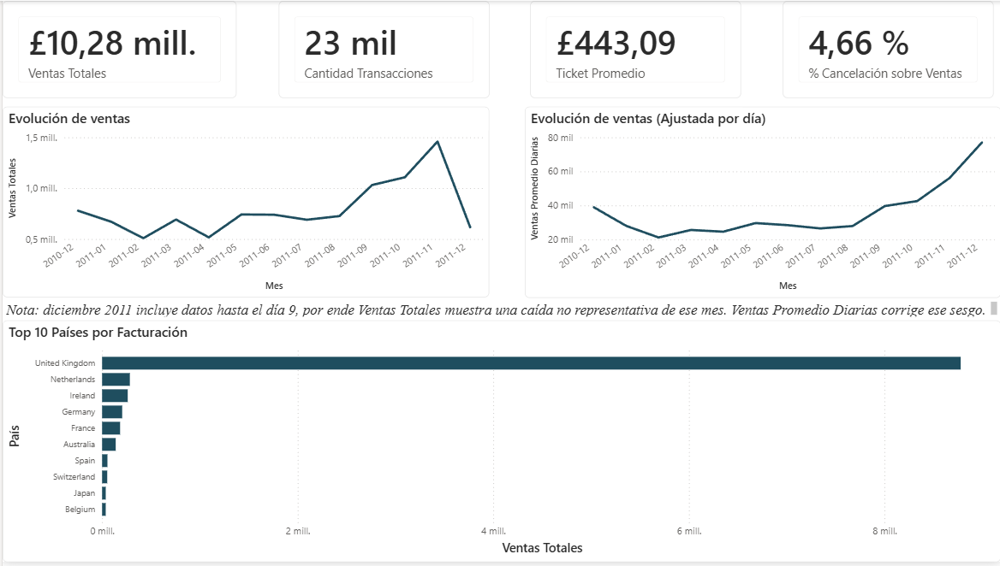
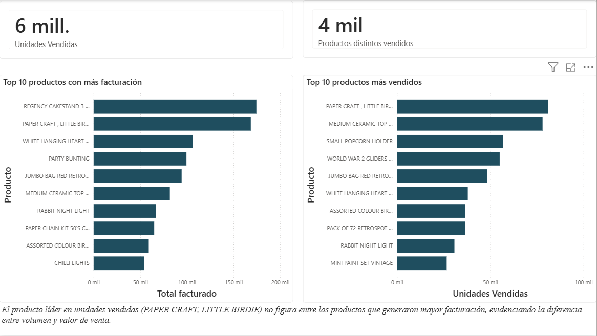
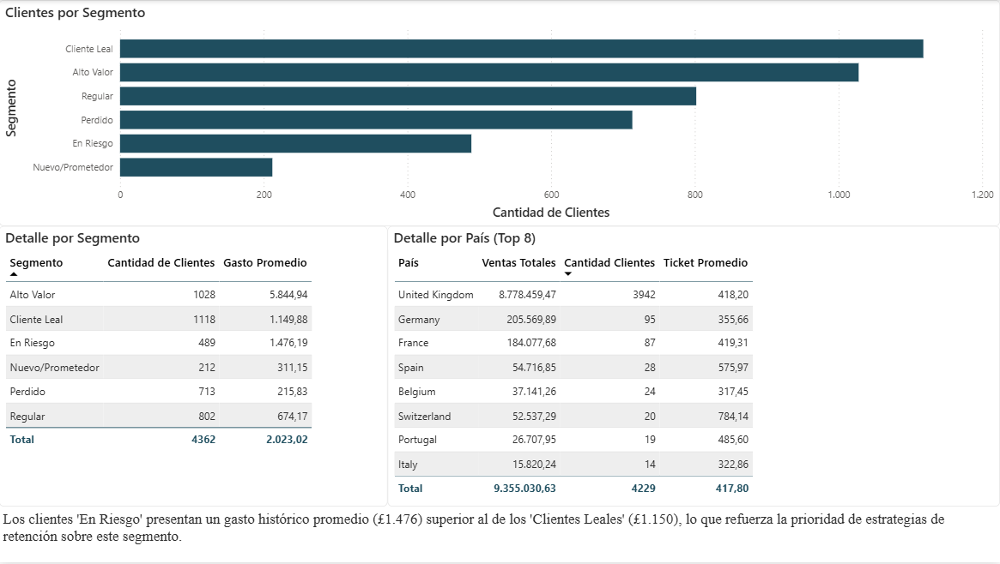

# Análisis de E-commerce/Retail 

[**⬇️ Descargar archivo del proyecto (.pbix)**] (https://github.com/Emmanuel-Barcelo/online-retail-powerbi-dashboard/blob/main/Analisis%20E-commerce%20-%20Retail.pbix)

## Contexto del negocio

Análisis de un dataset transaccional real de una tienda online (Reino Unido, periodo diciembre 2010 – diciembre 2011), con el objetivo de responder preguntas de negocio típicas de E-commerce/Retail : evolución de ventas, productos de mayor facturación, comportamiento de clientes por país, segmentación de clientes valiosos (RFM) y patrones de cancelación.

## Dataset

**Online Retail** ([UCI Machine Learning Repository](https://archive.ics.uci.edu/dataset/352/online+retail) / [Kaggle](https://www.kaggle.com/datasets/jihyeseo/online-retail-data-set-from-uci-ml-repo)): 541.909 transacciones de una tienda online no física con sede en Reino Unido, que vende artículos de regalo. Incluye clientes mayoristas y minoristas de distintos países.

**Por qué este dataset**: a diferencia de datasets más "prolijos" como Superstore, Online Retail contiene datos reales y sucios (nulos, códigos administrativos mezclados con productos, cancelaciones, ajustes de inventario), lo que permite realizar un trabajo de limpieza genuino.

## Preguntas de negocio

1. ¿Cuál es la evolución de las ventas en el tiempo (mensual, estacionalidad)?
2. ¿Qué productos y categorías generan mayor facturación y volumen de venta?
3. ¿Cómo se comportan los clientes según país?
4. ¿Qué clientes son más valiosos? (análisis RFM: Recencia, Frecuencia, Monto)
5. ¿Qué porcentaje de las ventas se pierde por cancelaciones/devoluciones, y qué patrón siguen?

## Estructura de columnas originales

| Columna | Descripción |
|---|---|
| InvoiceNo | Número de factura. Si arranca con "C", indica cancelación |
| StockCode | Código de producto |
| Description | Nombre del producto |
| Quantity | Unidades vendidas (negativo en cancelaciones) |
| InvoiceDate | Fecha y hora de la transacción |
| UnitPrice | Precio unitario |
| CustomerID | Identificador del cliente |
| Country | País del cliente |

## Proceso de limpieza de datos (Power Query)

### InvoiceNo
Convertido a tipo **Texto** (Power Query lo infería incorrectamente como número, lo cual habría sido inconsistente con los valores que arrancan con "C"). Sin otras acciones necesarias.

### StockCode
- Convertido a tipo **Texto**, corrigiendo una inferencia automática incorrecta a número que generaba errores en los códigos alfanuméricos.
- Se detectaron códigos administrativos no correspondientes a productos reales (`POST`, `D`, entre otros), identificados mediante una columna calculada que evalúa si el código contiene al menos un dígito numérico:
  ```
  Text.Select([StockCode], {"0".."9"}) = ""
  ```
  Un resultado `TRUE` (sin ningún dígito) indica un código especial, no un producto.
- **2.796 filas (0,52% del dataset)** correspondientes a estos códigos administrativos (envío, descuentos, ajustes) fueron excluidas del análisis ya que no representan transacciones de productos reales.

### Description
- Estandarizada a **mayúsculas** en toda la columna, para prevenir inconsistencias de conteo por diferencias de capitalización.
- Se identificó que un mismo `StockCode` puede tener más de una `Description` asociada en distintas filas (inconsistencia conocida del dataset). **Decisión**: no se corrige en el dato; se resuelve a nivel de análisis usando siempre `StockCode` como campo de agrupación real, y `Description` únicamente como etiqueta visual complementaria.

### Quantity
- Contiene valores negativos, que no son un error sino información de negocio: representan devoluciones/cancelaciones.
- Se identificaron **dos tipos distintos** de valores negativos:
  - **Cancelaciones de cliente** (`InvoiceNo` con prefijo "C"): conservadas, ya que alimentan la pregunta de negocio sobre devoluciones.
  - **Ajustes internos de inventario** (`Quantity` negativo sin prefijo "C" en `InvoiceNo`, confirmados por `UnitPrice = 0`, `CustomerID` nulo y descripciones como "damaged"): no corresponden a transacciones de cliente. Fueron identificados con una columna calculada:
    ```
    [Quantity] < 0 and not Text.StartsWith([InvoiceNo], "C")
    ```
    y excluidos del dataset.
- Validación aplicada tras el filtro: se confirmó que el 100% de los valores negativos remanentes corresponden a `InvoiceNo` con prefijo "C".

### InvoiceDate
Sin valores nulos (confirmado con perfilado de calidad de columna sobre el conjunto de datos completo). Tipo de dato correcto (`datetime`). Sin acciones de limpieza necesarias.

### UnitPrice
Se detectaron filas con `UnitPrice = 0` (sin valores negativos). Estas filas fueron excluidas, dado que un precio nulo no corresponde a una venta real facturable.

### CustomerID
- 25% de las filas presentan `CustomerID` nulo — transacciones válidas y reales, sin cliente identificado en el sistema de origen.
- **Decisión**: estas filas **no se eliminan** de la tabla base. Eliminarlas distorsionaría preguntas de negocio que no dependen del cliente (evolución de ventas, productos por facturación), restando ~25% de la facturación real registrada.
- El filtrado de nulos en `CustomerID` se aplicará únicamente a nivel de medida DAX, de forma acotada al análisis de RFM y comportamiento de clientes, sin afectar la tabla de hechos completa.

### Country
- Se identificaron valores no estándar: `EIRE`, `Channel Islands`, `Unspecified`, `European Community`.
- `EIRE` (nombre oficial de Irlanda en gaélico) fue renombrado a **"Ireland"** para su correcta interpretación en visualizaciones geográficas.
- `Channel Islands` se conservó sin cambios: es una ubicación geográfica real y válida.
- `Unspecified` se conservó sin cambios: representa ventas reales sin geolocalización capturada: se excluirá únicamente del análisis geográfico específico, no de la tabla base.
- `European Community` (58 filas) se conservó sin cambios, dado su bajo volumen y su validez como transacción real.

## Modelado de datos

Se transformó la tabla plana original en un **esquema en estrella**, compuesto por una tabla de hechos y tres dimensiones:

```
                    dim_Fecha
                        |
dim_Producto  —  fact_Ventas  —  dim_Cliente
```

### fact_Ventas (tabla de hechos)
Contiene una fila por transacción, con las claves de relación (`StockCode`, `CustomerID`, `InvoiceDate`) y las métricas propias de cada venta (`InvoiceNo`, `Quantity`, `UnitPrice`). Las columnas `Description` y `Country` se conservan en la tabla (por una dependencia de Power Query entre consultas) pero se **ocultan en la vista de informe**, ya que esa información vive correctamente en las dimensiones correspondientes y no debe usarse duplicada en las visualizaciones.

### dim_Producto
Generada como referencia de `fact_Ventas`, reducida a `StockCode` + `Description` únicos (3.816 productos). 

**Problema detectado y resuelto**: la primera deduplicación dejó 3.925 filas en lugar de las esperadas, debido a inconsistencias de formato (espacios en blanco y variaciones de mayúsculas/minúsculas) en `StockCode`, que hacían que Power Query tratara como "distintos" códigos que en realidad eran el mismo producto. Se resolvió normalizando la columna (`Trim` + mayúsculas) antes de deduplicar, quedando en 3.816 filas únicas.

### dim_Cliente
Generada como referencia de `fact_Ventas`, reducida a `CustomerID` + `Country` únicos (4.379 clientes).

**Problema detectado y resuelto — valores nulos como clave de relación**: Power BI no permite valores en blanco en el lado "uno" de una relación. Como `CustomerID` nulo representa ~25% de las transacciones (ventas reales sin cliente identificado, según se documentó en la etapa de limpieza), se aplicó el patrón estándar de modelado dimensional de **"miembro desconocido"**: los valores nulos de `CustomerID` se reemplazaron por `0` tanto en `fact_Ventas` como en `dim_Cliente`, representando explícitamente la categoría "cliente no identificado" en lugar de dejarla en blanco. Este valor se excluirá puntualmente en las medidas de análisis de clientes (RFM), sin afectar las métricas de ventas generales.

### dim_Fecha
Tabla calculada en DAX (no pasa por Power Query), generada con `CALENDAR()` cubriendo el rango exacto de fechas de `fact_Ventas`. Incluye columnas derivadas para análisis temporal: `Año`, `NumeroMes`, `NombreMes` (ordenado cronológicamente vía `NumeroMes`), `AñoMes`, `Trimestre` y `DiaSemana`.

### Relaciones
Las tres relaciones se configuraron como **uno a varios (1:\*)**, con dirección de filtro única (desde la dimensión hacia `fact_Ventas`):

| Dimensión | Campo | → | fact_Ventas |
|---|---|---|---|
| dim_Producto | StockCode | → | StockCode |
| dim_Cliente | CustomerID | → | CustomerID |
| dim_Fecha | Date | → | InvoiceDate |

## Medidas DAX

Se creó una tabla dedicada **`_Medidas`** (tabla vacía, sin datos reales, generada con `{BLANK()}`) para alojar todas las medidas de forma organizada, separadas de las columnas de datos crudos de `fact_Ventas` — práctica estándar de modelado en Power BI. La columna técnica `Value` generada automáticamente al crear la tabla fue ocultada, por no tener significado de negocio.

En total se definieron **16 medidas**, agrupadas por su rol:

**Medidas base (bloques reutilizables)**
- `Ventas Totales`: suma de `Quantity × UnitPrice`, excluyendo cancelaciones (`Quantity > 0`)
- `Devoluciones Totales`: mismo cálculo, acotado a cancelaciones (`Quantity < 0`)
- `Ventas Netas`: suma de las dos anteriores
- `Cantidad Transacciones`: conteo de facturas únicas (`DISTINCTCOUNT`, no de filas)
- `Ticket Promedio`: Ventas Totales ÷ Cantidad de Transacciones

**Evolución temporal (pregunta 1)**
- `Ventas Mes Anterior`: usa `DATEADD` sobre `dim_Fecha` para desplazar el contexto de fecha un mes atrás
- `% Variación Mensual`: variación porcentual respecto al mes anterior

**Productos (pregunta 2)**
- `Unidades Vendidas`: suma de cantidades vendidas (excluyendo cancelaciones)
- `Ranking Producto por Ventas`: posición de cada producto según Ventas Totales, usando `RANKX` + `ALL` para comparar contra el universo completo de productos

**Comportamiento por país (pregunta 3)**
- `Clientes Únicos`: clientes distintos identificados, excluyendo el miembro sustituto (`CustomerID = 0`)

**RFM (pregunta 4)**
- `Fecha Última Compra`, `Recencia (días)`, `Frecuencia`, `Monto Total Cliente`: las cuatro medidas base para el análisis de Recencia, Frecuencia y Monto por cliente, todas excluyendo el cliente sustituto sin identificar

**Cancelaciones (pregunta 5)**
- `Cantidad Cancelaciones`: facturas únicas con `Quantity` negativo
- `% Cancelación sobre Ventas`: proporción de facturación perdida por devoluciones

Todas las medidas están escritas para ser **reutilizables entre visualizaciones**: no responden una pregunta de negocio por sí solas, sino que se especializan según el contexto de filtro (campos de fila/columna/segmentador) que se les aplique en cada visual del dashboard.

## Segmentación RFM

Las medidas DAX de `Recencia`, `Frecuencia` y `Monto` (por sí solas) permiten calcular un valor por cliente, pero no compararlo contra el resto de la base — necesario para clasificar en quintiles. Por eso se construyó una **tabla calculada dedicada**, `Resumen_RFM`, con una fila por cliente real (excluyendo el miembro sustituto):

```
Resumen_RFM = 
ADDCOLUMNS(
    FILTER(VALUES(dim_Cliente[CustomerID]), dim_Cliente[CustomerID] <> 0),
    "Recencia", CALCULATE([Recencia (días)]),
    "Frecuencia", CALCULATE([Frecuencia]),
    "Monto", CALCULATE([Monto Total Cliente])
)
```

**Bug detectado y corregido**: la primera versión de la medida `Recencia (días)` devolvía 0 para el 100% de los clientes. La causa fue un problema de contexto de fila: `MAX(fact_Ventas[InvoiceDate])`, al evaluarse dentro de `CALCULATE` en el contexto de un cliente puntual (transición de contexto), quedaba filtrado a las transacciones de ese mismo cliente en lugar de mirar la fecha máxima del dataset completo — devolviendo siempre la misma fecha que `Fecha Última Compra`. Se corrigió envolviendo el `MAX` en `CALCULATE(..., ALL(fact_Ventas))`, forzando que ignore el filtro de cliente heredado:

```
Recencia (días) = 
DATEDIFF(
    [Fecha Última Compra],
    CALCULATE(MAX(fact_Ventas[InvoiceDate]), ALL(fact_Ventas)),
    DAY
)
```

Sobre `Resumen_RFM`, se agregaron columnas calculadas para el puntaje 1-5 de cada dimensión (por percentiles, invertido en el caso de Recencia, donde un valor bajo es mejor) y una columna final de segmento de negocio:

| Segmento | Regla | Clientes |
|---|---|---|
| Alto Valor | R≥4, F≥4, M≥4 | 1.028 |
| Cliente Leal | R≥3, F≥3 | 1.118 |
| Nuevo/Prometedor | R≥4, F≤2 | 212 |
| En Riesgo | R≤2, F≥4 | 489 |
| Perdido | R≤2, F≤2, M≤2 | 713 |
| Regular | (resto) | 802 |

## Dashboard

El informe consta de **3 páginas**, diseñadas para cubrir las 5 preguntas de negocio sin solaparse entre sí, siguiendo un criterio de jerarquía (panorama general primero, detalle específico después) y de agrupación por entidad de análisis (tiempo/general, productos, clientes):

### Página 1 — Resumen Ejecutivo



KPIs generales (Ventas Totales, Cantidad de Transacciones, Ticket Promedio, % Cancelación), evolución mensual de ventas y Top 10 países por facturación.

**Hallazgo y corrección aplicada**: el gráfico de evolución mostraba una caída pronunciada en diciembre 2011. Se identificó que el dataset registra transacciones de ese mes solo hasta el día 9, por lo que la caída no refleja una baja real de actividad. Se agregó un segundo gráfico con la medida `Ventas Promedio Diarias` (Ventas Totales ÷ días distintos con ventas en el período), que corrige el sesgo — bajo esta métrica, diciembre resulta ser el mes de mayor actividad comercial, consistente con la temporada de compras navideñas. Por otra parte, Reino Unido representa cerca del 90% de los clientes identificados de la base, dejando a los demás países con una porción menor del negocio.

### Página 2 — Productos



Top 10 productos por facturación y Top 10 por unidades vendidas, mostrados lado a lado para contrastar volumen vs. valor.

**Hallazgo**: el producto líder en unidades vendidas (PAPER CRAFT, LITTLE BIRDIE) no figura entre los de mayor facturación, y viceversa con el líder en facturación (REGENCY CAKESTAND 3 TIER) — evidencia de que volumen de venta y valor generado no siempre coinciden en el mismo producto.

### Página 3 — Clientes y Segmentación



Distribución de clientes por segmento RFM, detalle de gasto promedio por segmento, y detalle de ventas/clientes por país (Top 8 por cantidad de clientes).

**Hallazgo**: el segmento "En Riesgo" (489 clientes, con alta frecuencia histórica de compra pero baja recencia) presenta un gasto promedio histórico de £1.476 — superior al del segmento "Cliente Leal" (£1.150). Es decir, una porción relevante de los clientes que están dejando de comprar fueron, en términos de valor histórico, mejores clientes que muchos de los que sí se retienen — reforzando la prioridad de este segmento para acciones de retención.

## Recomendaciones de negocio

- **Priorizar retención sobre el segmento "En Riesgo"**: su valor histórico promedio supera al de clientes actualmente leales, representando la oportunidad de mayor impacto económico en una estrategia de reactivación.
- **Diferenciar estrategia de stock por tipo de producto**: separar el catálogo entre productos de alto volumen/bajo precio y de bajo volumen/alto valor unitario, dado que ambos grupos no coinciden y requieren lógicas de reposición distintas.
- **Profundizar el mercado fuera de Reino Unido de forma selectiva**: países como Países Bajos e Irlanda muestran tickets promedio elevados con pocos clientes (posible perfil mayorista), representando una oportunidad de expansión dirigida antes que masiva.
- **Investigar la causa de cancelaciones**: con una tasa de cancelación del 4,66% sobre ventas, se recomienda una futura extensión del análisis que cruce cancelaciones por producto/categoría, para identificar si hay ítems con tasas de devolución atípicas.

## Estructura del proyecto

```
online-retail-analysis/
├── data/
│   └── Online Retail.xlsx
├── screenshots/
│   ├── pagina1_resumen_ejecutivo.png
│   ├── pagina2_productos.png
│   └── pagina3_clientes_segmentacion.png
├── online-retail-analysis.pbix
├── tema_powerbi_online_retail.json
└── README.md
```

## Stack técnico

- **Power BI Desktop** — Power Query (ETL), modelo de datos (esquema en estrella), DAX
- Tema visual personalizado (JSON) para consistencia de marca entre las 3 páginas
